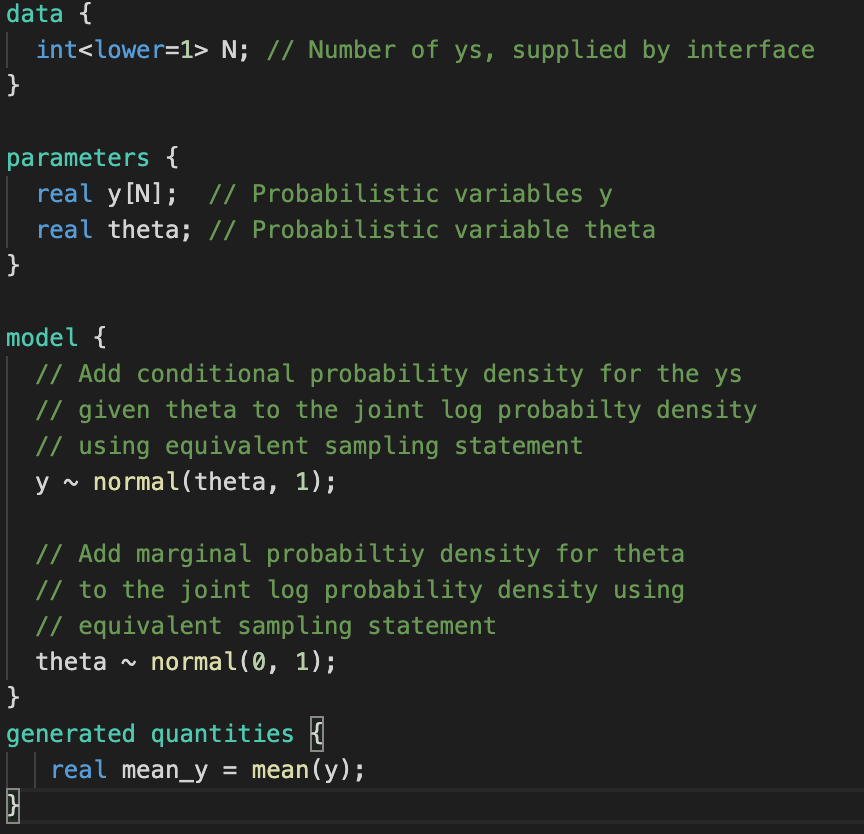

# Lab 2 -  Intro to stan
F - number of letters in first name
L - number of letters in last name


## Excercise 1 - generated quantities
```code_1.stan```


1. Compile code_1.stan and sample from it using M=F
2. Create a pandas dataframe from resulting draws.
3. Plot a histogram for each of y_sim and lambda

## Excercise 2 - constraints on the data
```code_2.stan```


```code_3.stan```


1. Observe how constraints on data behave for code_2 and code_3

### Excercise 3 - constraints on the parameters
```code_4.stan```


```code_5.stan```


1. Constraints in parameters behave more subtely. We are infering theta without data from its prior.
2. Please see diagnostic messages from code_4 and how samples from it compare to the probability distribution.
3. Verify what changes if constraints are added as in code_5

### Excercise 4 - functions and different functionalities of stan

```code_6.stan```


1. Stan outside of sampling allows for certain computational tools. In particular equation solving.
2. Using code_6 find the standard deviation of half_normal distribution, such that with 99% probability samples from it will be less than (F+L)/2.

### Excercise 5 - different methods of defining models

Stan models can be defined using sampling statements

```code_7.stan```


However, what we really happens is that we are defining logarithm of the joint probability distribution, i.e.:

$$
\log p(\mu,\theta)=\log p(\mu|\theta)+\log p(\theta)
$$

Such declaration is done in the following way 


```code_8.stan```


But specification can be even more detailed, and model can affect even individual coeeficients of vector parameters

```code_9.stan```


1. Implement all the examples
2. Use them to generate distributuion for N=F.


### Excercise 6 - generated quantities post sampling

Sometimes more than in parameters we are interested in their functions. 


```code_10.stan```



Unfortunately, such interest can happen after we complete sampling which can be often time consuming. We can do such analysis in python or directly on samples, but cmdstan allows us to solve it in a different way. 

1. Implement ```code_10.stan```
2. Using generate_quantities() method use samples from previous excercises and and analyze mean of $y$.