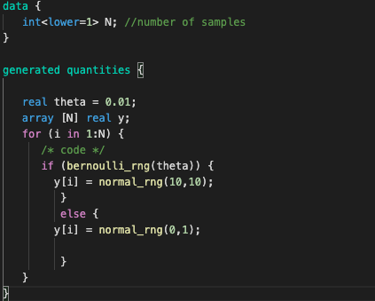
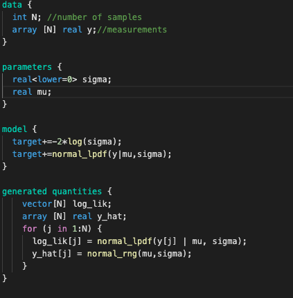
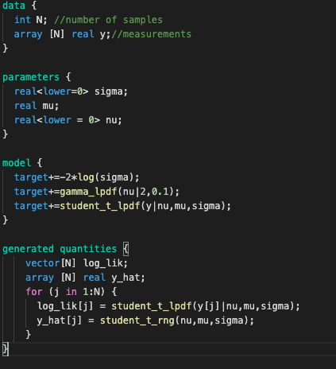
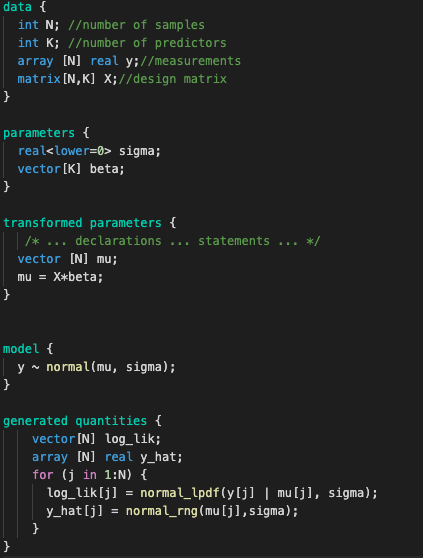

# Lab 6 -  Model comparison

In this excercise we will learn about comparing models using metrics predicting out of sample behavior.

Main idea is to instead of splitting the dataset into two parts (test and training set) to estimate how model would behave in presence of new data.
This is being done by evaluating so called *log likelihood* which is an array of values of logarithm of likelihood for each of datapoints individually.

We will use this informations with two metrics:
- Watanabe-Akaike Information Criterion (also known as Widely Applicable Information Criterion, WAIC), which is averages log likelihood and estimates the effective number of paraemeters in the model
- PSIS-LOOCV - Pareto Smoothed Importance Sampling Leave-one-out Cross Validation. It is an estimate of value obtained from Leave-one-out Cross Validation by using modified importance sampling method instead of running inference N times where N is number of samples, leaving one each time. 

For this excercise code is provided in form of print-screens. 
## Excercise 1 - generate data


F - number of letters in first name
L - number of letters in last name
N = (L+F)*100

```code_1.stan```



```code_2.stan```


1. Compile code_1.stan and  code_2.stan 
2. Generate data for rest of excercises.

## Excercise 2 - compare normal and student models for data from first file
```code_3.stan```



```code_4.stan```



1. Compile both models
2. Fit both models
3. Using az.compare and az.plot_compare analyze both models using ```loo``` and ```waic``` criteria. 

### Excercise 3 - compare models with different numbers of predictors
```code_5.stan```



1. Compile model
2. Compare models for 1, 2 and 3 predictors as in previous excercise
