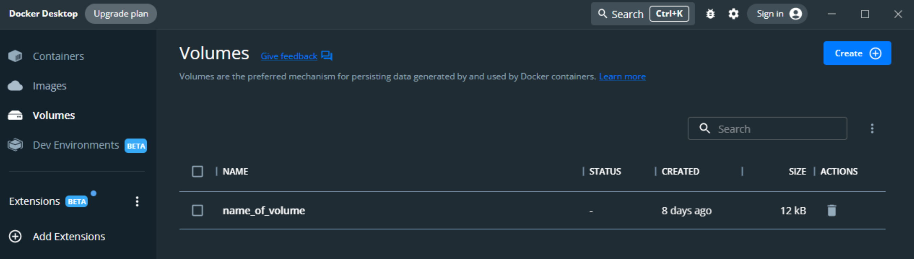
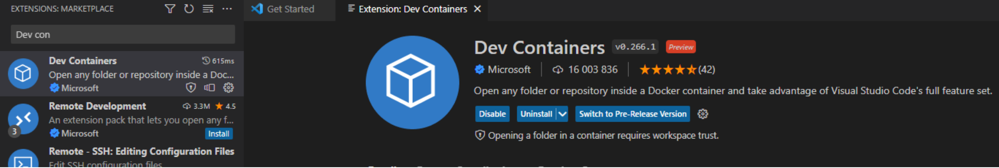
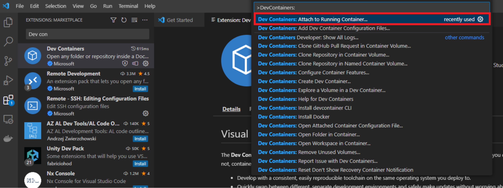

# Data Analytics - Lecture and Laboratory Excercises

## Lectures
## Laboratories 


## Docker instruction
# Installation and configuration instructions for Docker
1.	Brief introduction to Docker: https://www.youtube.com/watch?v=Gjnup-PuquQ 
2.	Download and install Docker Desktop software for the appropriate operating system from https://www.docker.com 

    Depending on the user's computer configuration, it may be necessary to install additional software during the installation process. Follow the manufacturer's documentation:

    Mac: https://docs.docker.com/desktop/install/mac-install/ 

    Windows: https://docs.docker.com/desktop/install/windows-install/ 

    Linux: https://docs.docker.com/desktop/install/linux-install/ 
    
    After a successful installation, run the application.

3.	All data, scripts, etc. will be stored inside the container by default. As a result, they will be lost after the container is removed. To avoid such problems, create a volume. Open any command interpreter (PowerShell, cmd, etc.), preferably with administrator privileges. Then execute the command:
    ```
    docker volume create --driver local -o o=bind -o type=none -o device="path_to_localization" name_of_volume
    ```
    This will create a volume in the folder specified in path_to_localization.
Created volumes can be viewed in Docker Desktop in the Volumes tab:

    

4.	In the next step, you need to run a container based on an image. Docker allows you to upload and download different images on dockerhub. For the purpose of this subject, you need to download the prepared image:
    ```
    docker pull iszagh/cmdstan_python:1
    ```
5.	And run the container with the command:
    ```
    docker run -ti -d --name name_of_container -v name_of_volume:/home iszagh/cmdstan_python:1
    ```
    /home points to the folder inside the container connected to the volume.

    The container can be stopped and resumed at any time without losing data, but permanent deletion will result in the loss of all data that is not in the attached volume.

6.	To be able to write code in the running container, you need to attach a code editor. For this instruction, Visual Studio Code is used. You need to download the Dev Containers extension. 

    

    In the search field, type: 
    ```
    >DevContainers:
    ```
    And select the option “Attach to Running Container…”

    

    Then select the previously launched container from the list.
For convenient work with the code, it is worth downloading extensions appropriate for the language.
